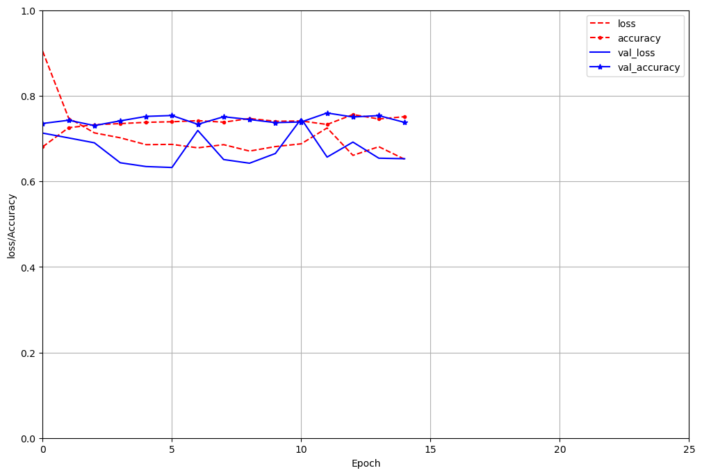
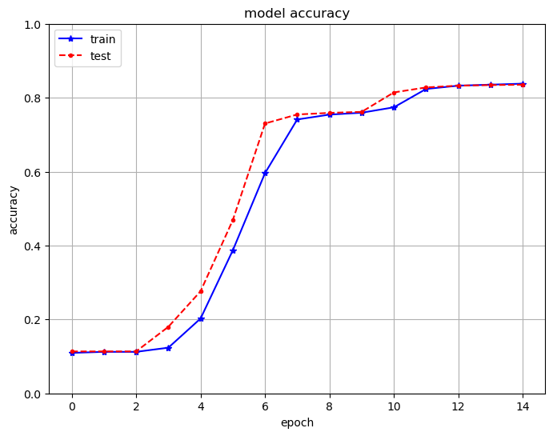
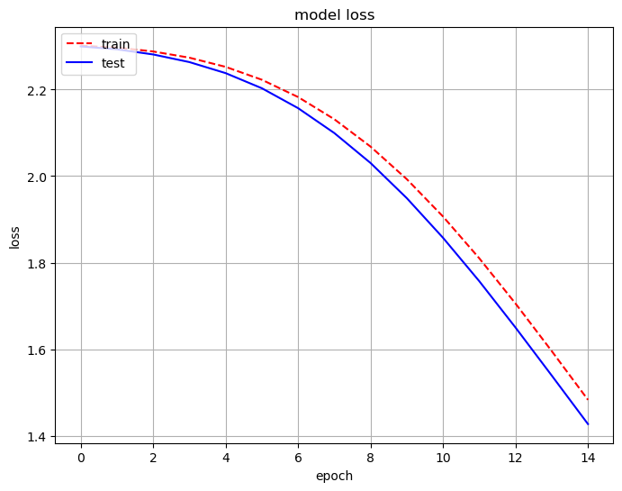

# Implementing Cyclic Learning Rates in Keras

This article assumes that the reader is familiar with the concepts of a Cyclic learnign rate and focuses on the Implementation in Keras.

**This Notebook:** 

**For theory:**

- Refer paper: [Cyclical Learning Rates for Training Neural Networks by 
Leslie N. Smith](https://arxiv.org/abs/1506.01186).
- Kudos to [bckenstler's CLR repo](https://github.com/bckenstler/CLR)

## 1. Little brief about Learning Rates and Cyclic Learning Rates:
### 1.1 What is Learning Rate:

The rate at which a Neural network adapts to the new patterns in the data. Yes, we want our model to identify all the patterns in the data. So setting the learning rate to a high value seems a sensible thing to do. Nope. 

There's a trade-off:

1. Setting a very high learning rate will cause the model to adapt to the new patterns fast and forgets the old patterns which it has identified before. The model will only be successful on the recent patterns but not even on the old patterns .
2. Setting a low learning rate causes the model to only be effective on the patterns it has already learnt and it won't adapt to the new patterns easily.

`Learning rate` is arguably the most important hyper-parameter while training a NN. So setting the right value for the Learning rate is important.

### 1.2 Leslie's Hack 
If the maximum value is too rapidly adapting and the minimum value is too slowly adapting, then why not use a learning rate that cycles between the min value and the max value. In this way, the NN can adapt the new patterns and keep track of the old patterns.

## 2. Implementing Cylic learning Rate in Keras on MNIST dataset
Leslie putforths in his paper that using cyclic lerning rates and a big batch size will help the model converge faster and yield better results.

So, these are the two metrics we are watching for: Speed and Accuracy.
### 2.1. With a Constant Learning Rate 
 - We've build a Neural Network with 3 dense layers, with each layer with neurons 100, 50, 10 respectively. 

#### 2.1.1 Compiling the Model:
 - **Activation Function:** We use `softmax` as the activation function for each layer in the network
 - **Loss:** `categorical_crossentropy`
 - **Optimizers:** `Adam` with `learning_rate = 0.1`
 - **metrics:** `categorical_crossentropy_accuracy`

#### 2.1.2 Fitting the model:
  - Epochs = 15
  - batch_size = 100

#### 2.1.3 Results
 - Time taken for training the Network:  30.209205443000428s
 - Validation Accuracy:0.7598

 

### 2.2 With Cyclic Learning Rate
- We use the same architecture as before with three layers of neuros 100,50,10 respectively.
- We implement the Cyclic learning rate as a callback.
- clone the repo [CLRrepo](https://github.com/bckenstler/CLR) in your current working directory where your notebook resides.
- Import callbacks abd clr_callback
    - from keras.callbacks import *
    - from clr_callback import *

#### 2.2.1 Compling the Cyclic Model.
Same as in [Compiling the model](#211-compiling-the-model)

#### 2.2.2 Fitting the model:
- We initialize the CylcicLR instance with the `triangular` policy and set it to `clr_traingular` variable.
- We'll set this `clr_traingular` variable to callbacks as a list.
- Epochs = 15
- **batch_size = 2000**

#### 2.2.3 Results
- Time taken for training the neural net:  5.474767358999998 s
- Validation Accuracy: 0.8352

## 3. Conclusion:
The results are self-explanatory that the model performed faster and better with Cyclic Learning rate with a bigger batch_size than with a Constant Learning Rate with a small batch_size.

<!-- step_size = 2000
iterations = 10000
The learning rate increases from 0.001 to 0.006 thorugh the iterations 0-2000 and then falls back from 0.006 to 0.001 throught the iteration range of 2000-4000. This happens through out the whole number of iterations

 - total no.of instances = 60000
 - epochs = 15
 - batch_size = 100
 - total no. of iterations per epoch = 600 * 100 = 60000
 - total no.of iterations for the whole training = 60000*15 = 900000

The accuracy and loss is calculated at the end of each epoch with a cyclic learning rate. -->